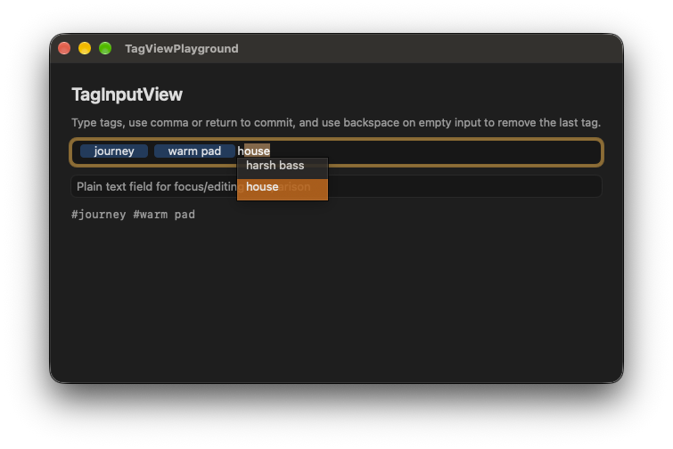

# TagInputView

`TagInputView` is a reusable AppKit tag-entry control backed by `NSTokenField`.

It provides:

- plain `NSArray<NSString *> *` tag values
- synchronous suggestions
- duplicate filtering
- keyboard-first editing
- width-dependent preferred height with whole-token wrapping; a token wider than
  the control truncates within that token
- hashtag storage conversion through `TagCodec`
